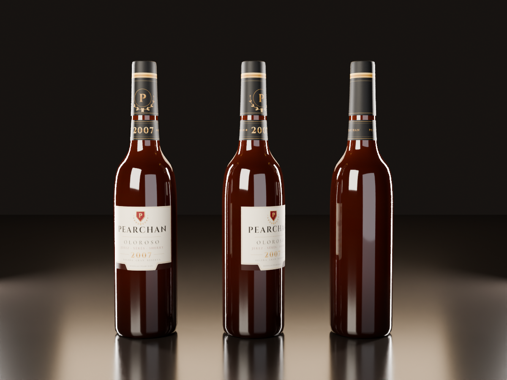

# ワインボトル (VRChat 用)

参考画像のシェリー型ボトル「PEARCHAN OLOROSO」をもとにした、アバターに持たせるワインボトルです。
金箔・紋章・ネックラベルなどで高級感を出しています。




## 仕様

| 項目 | 内容 |
| --- | --- |
| 形 | シェリー型。細長い胴、丸く高い肩、長くゆるやかに細くなる首、深い上げ底 |
| ラベル | アイボリーの紙 (細かい繊維の質感)、金箔の二重罫、紋章 (盾 + P + 月桂樹)、PEARCHAN / OLOROSO / JEREZ · XÉRÈS · SHERRY、金箔の年号 **2007**、SOLERA GRAN RESERVA、下辺中央の出っ張りに BODEGAS PEARCHAN |
| ネックラベル | 黒地に金。正面に 2007、左右に PEARCHAN |
| キャップシール | サテンの黒。2 本の溝の間に金の帯、正面に金の紋章、天面に金のメダル |
| ガラス | オロロソの深いマホガニー (底ほど暗い) |
| 向き | 立てた状態。Unity で Y が上、注ぎ口が真上 |
| 大きさ | 高さ 30cm / 太さ (直径) 7cm。原点は底面の中心 |
| 注ぎ口 | 口の真上の中心に空のオブジェクト `Spout` (WineBottle の子) |
| 中のワイン | なし (外側の瓶だけ) |
| ポリゴン | 2,784 三角形 |
| マテリアル | 2 個: `WineBottle_Glass` (ガラス) / `WineBottle_Label` (ラベル・ネックラベル・キャップ) |
| テクスチャ | 1 枚 `WineBottle_Atlas.png` (2048×2048) を 2 つのマテリアルで共有 |
| 構成 | 瓶・キャップシール・ラベルが 1 つのメッシュ `WineBottle` |
| ラベルの正面 | オブジェクトの前方 (Unity の +Z 方向) |
| 動作確認 | Blender 5.1.2 |

## ファイル

- `make_wine_bottle.py` … Blender でボトルを作って FBX に書き出すスクリプト
- `make_label_texture.py` … ラベルなどのテクスチャ `WineBottle_Atlas.png` を作るスクリプト (Pillow を使用)
- `WineBottle_Atlas.png` … 生成済みのテクスチャ
- `fonts/` … テクスチャに使ったフォント (Cinzel / Cormorant Garamond、SIL Open Font License)
- `../export/WineBottle.fbx` … このスクリプトで書き出し済みの FBX (Blender 5.1.2 で作成)

## Blender での使い方

1. `make_wine_bottle.py` と `WineBottle_Atlas.png` を同じフォルダに置く
2. Blender の **Scripting** タブ → テキストエディタの「開く」で `make_wine_bottle.py` を開く
3. 「スクリプト実行」(▶ または Alt+P)
4. シーンに `WineBottle` と `Spout` ができ、FBX が書き出されます
   - 書き出し先: .blend を保存していればそのフォルダ、未保存ならスクリプトのフォルダ
   - 書き出し先を決めたいときはスクリプト上部の `OUTPUT_DIR` にフォルダを書く
   - 出力: `WineBottle.fbx` と `WineBottle_Atlas.png`

もう一度実行すると、前の `WineBottle` / `Spout` を消してから作り直します。それ以外のオブジェクトは消しません。書き出すのは `WineBottle` と `Spout` だけです。

コマンドラインでも実行できます:

```
blender -b -P make_wine_bottle.py -- --out <出力フォルダ>
```

大きさや丸さを変えたいときは、スクリプト上部の `HEIGHT` / `DIAMETER` / `SEGMENTS` を変更してください。
ラベルの文字や年号を変えたいときは `make_label_texture.py` (`YEAR` など) を編集して実行し直してください。

## Unity に入れるとき

- FBX は「回転 0・スケール 1・1unit = 1m」で読み込まれる設定で書き出しています。
- テクスチャは FBX に埋め込み済みです。マテリアルを自分で作る場合は、2 つとも `WineBottle_Atlas.png` を使ってください。
- テクスチャを軽くしたいときは、Unity のテクスチャ設定で Max Size を 1024 にしても見た目はほぼ変わりません。
- lilToon で高級感を出すおすすめ設定 (目安):
  - `WineBottle_Glass`: Smoothness 0.9 前後、反射 (Reflection) オン、リムライトを弱めに
  - `WineBottle_Label`: Smoothness 0.3〜0.4、反射はオフか弱め
