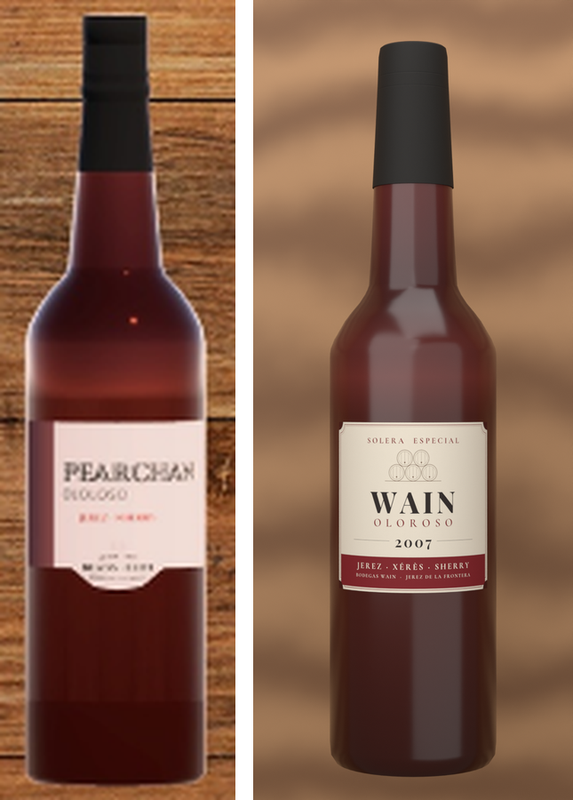
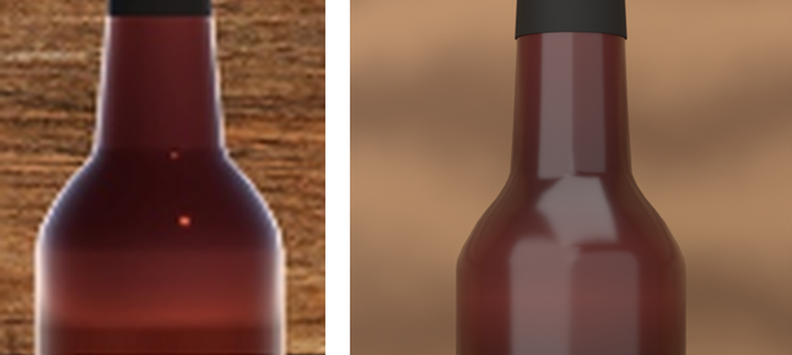
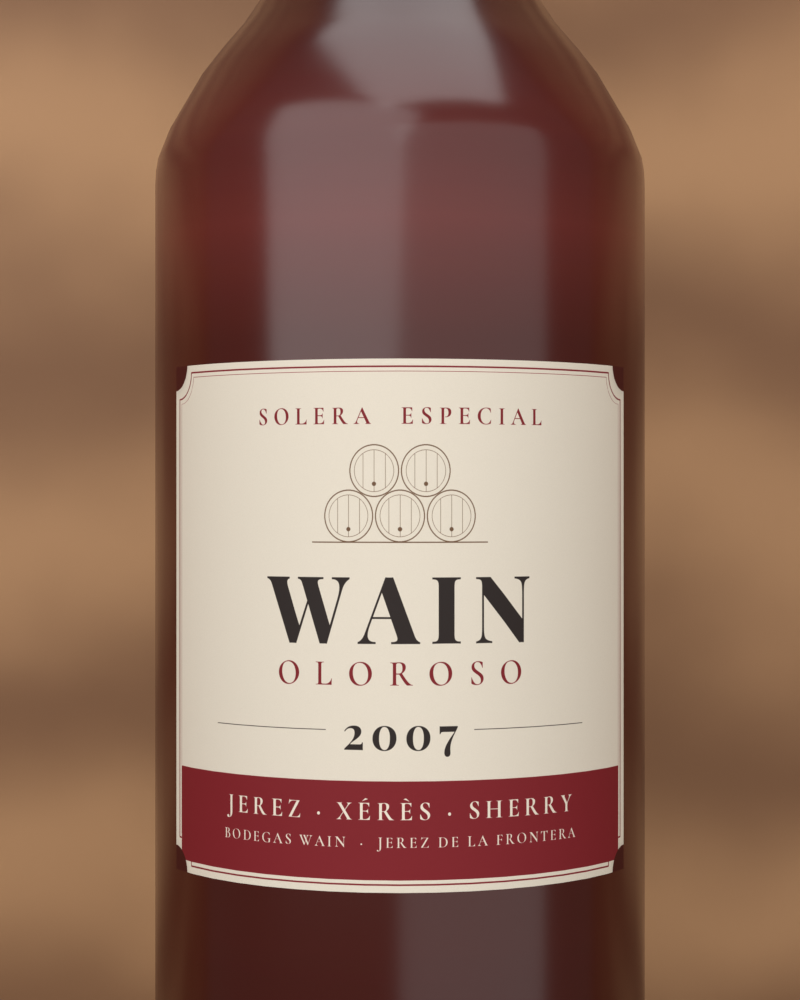

# ワインボトル (VRChat 用)

参考画像のシェリー型ボトルの形と質感をもとにした、アバターに持たせるワインボトルです。
ラベルはオリジナル (架空の銘柄「WAIN」、2007 年) です。

参考画像 (左) と今回のモデル (右):



肩まわりの比較 (左: 参考画像 / 右: モデル):





## 仕様

| 項目 | 内容 |
| --- | --- |
| 形 | シェリー型。細長い胴、短く丸い肩、太めでほぼまっすぐな首 (胴の約 50%)、上げ底。肩と首は参考画像の輪郭を測って合わせています |
| ラベル | オリジナル。クリーム色の紙 (四隅を内側に丸く切り欠いた形)、細い赤の二重枠、SOLERA ESPECIAL、積み重ねた樽 (ソレラ) の線画、銘柄 WAIN、OLOROSO、年号 **2007**、下の深い赤の帯に JEREZ · XÉRÈS · SHERRY / BODEGAS WAIN · JEREZ DE LA FRONTERA |
| キャップシール | つや消しの黒。上の方に細い溝 2 本 |
| ガラス | 参考画像の赤褐色 (底と肩は暗め、ラベルの上は少し明るい)。ハイライトは柔らかめ |
| 向き | 立てた状態。Unity で Y が上、注ぎ口が真上 |
| 大きさ | 高さ 30cm / 太さ (直径) 7cm。原点は底面の中心 |
| 注ぎ口 | 口の真上の中心に空のオブジェクト `Spout` (WineBottle の子) |
| 中のワイン | なし (外側の瓶だけ) |
| ポリゴン | 2,976 三角形 |
| マテリアル | 2 個: `WineBottle_Glass` (ガラス、ツヤあり) / `WineBottle_Label` (ラベル・キャップ、つや消し) |
| テクスチャ | 1 枚 `WineBottle_Atlas.png` (2048×2048) を 2 つのマテリアルで共有 |
| 構成 | 瓶・キャップシール・ラベルが 1 つのメッシュ `WineBottle` |
| ラベルの正面 | オブジェクトの前方 (Unity の +Z 方向) |
| 動作確認 | Blender 5.1.2 |

## ファイル

- `make_wine_bottle.py` … Blender でボトルを作って FBX に書き出すスクリプト
- `make_label_texture.py` … ラベルなどのテクスチャ `WineBottle_Atlas.png` を作るスクリプト (Pillow を使用)
- `WineBottle_Atlas.png` … 生成済みのテクスチャ
- `fonts/` … テクスチャに使ったフォント (Playfair Display / Cormorant Garamond、SIL Open Font License)
- `../export/WineBottle.fbx` … このスクリプトで書き出し済みの FBX (Blender 5.1.2 で作成)

## Blender での使い方

1. `make_wine_bottle.py` と `WineBottle_Atlas.png` を同じフォルダに置く
2. Blender の **Scripting** タブ → テキストエディタの「開く」で `make_wine_bottle.py` を開く
3. 「スクリプト実行」(▶ または Alt+P)
4. シーンに `WineBottle` と `Spout` ができ、FBX が書き出されます
   - 書き出し先: .blend を保存していればそのフォルダ、未保存ならスクリプトのフォルダ
   - 書き出し先を決めたいときはスクリプト上部の `OUTPUT_DIR` にフォルダを書く
   - 出力: `WineBottle.fbx` と `WineBottle_Atlas.png`

もう一度実行すると、前の `WineBottle` / `Spout` を消してから作り直します。それ以外のオブジェクトは消しません。書き出すのは `WineBottle` と `Spout` だけです。

コマンドラインでも実行できます:

```
blender -b -P make_wine_bottle.py -- --out <出力フォルダ>
```

大きさや丸さを変えたいときは、スクリプト上部の `HEIGHT` / `DIAMETER` / `SEGMENTS` を変更してください。
ラベルの銘柄や年号を変えたいときは `make_label_texture.py` の `BRAND` / `YEAR` を編集して実行し直してください。

## Unity に入れるとき

- FBX は「回転 0・スケール 1・1unit = 1m」で読み込まれる設定で書き出しています。
- テクスチャは FBX に埋め込み済みです。マテリアルを自分で作る場合は、2 つとも `WineBottle_Atlas.png` を使ってください。
- テクスチャを軽くしたいときは、Unity のテクスチャ設定で Max Size を 1024 にしても見た目はほぼ変わりません。
- lilToon で参考画像の質感に寄せる設定 (目安):
  - `WineBottle_Glass`: Smoothness 0.75〜0.8 (ハイライトが柔らかく広がる程度)、反射は弱め
  - `WineBottle_Label`: Smoothness 0.2〜0.3、反射オフ
