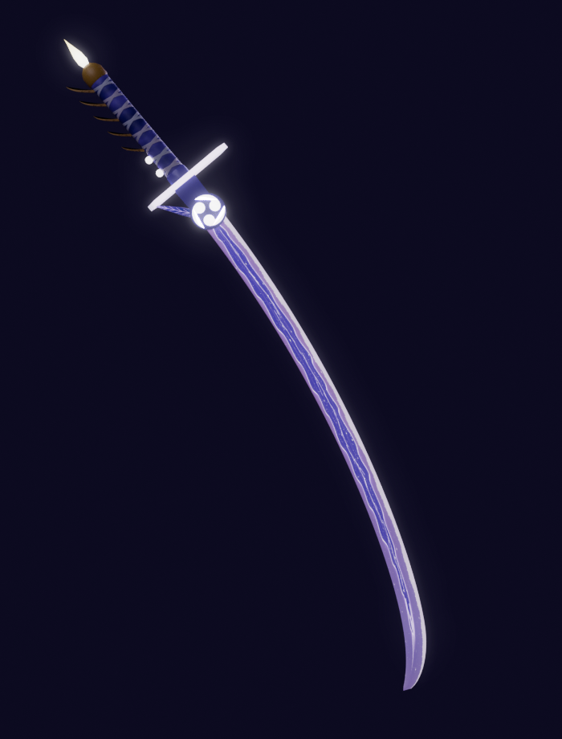
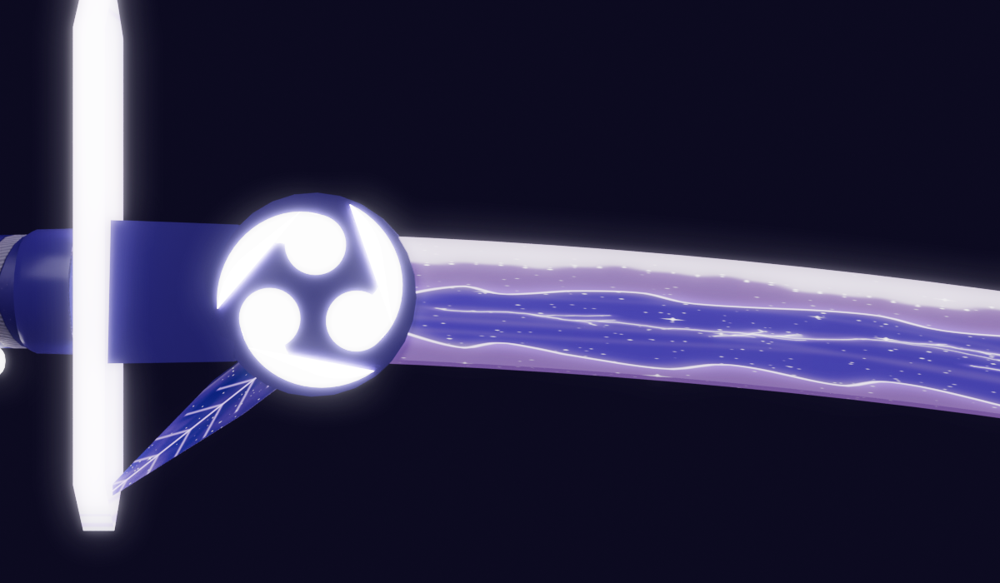
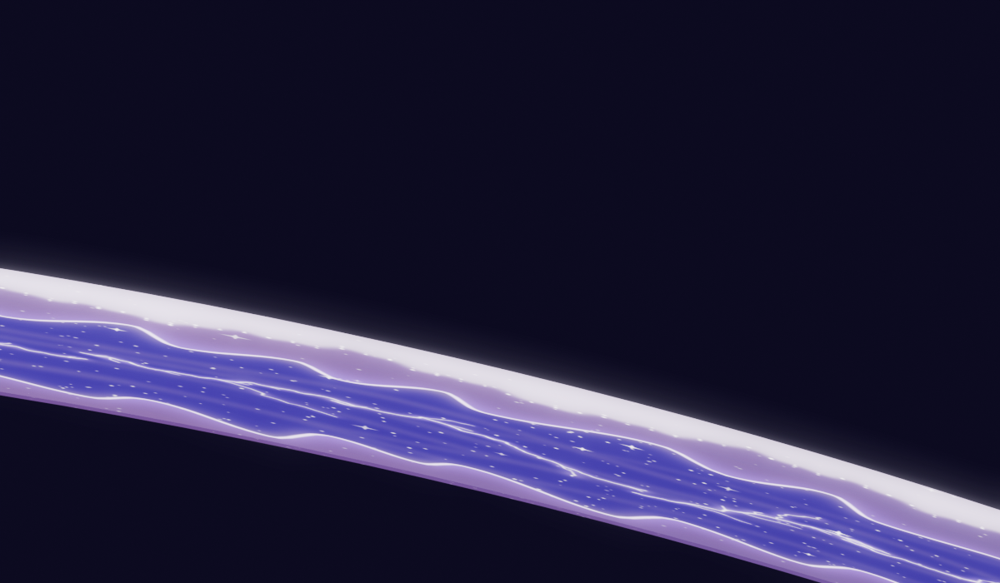
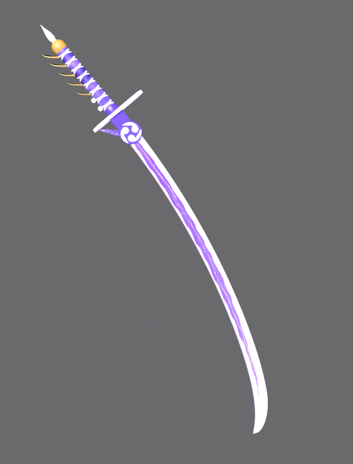
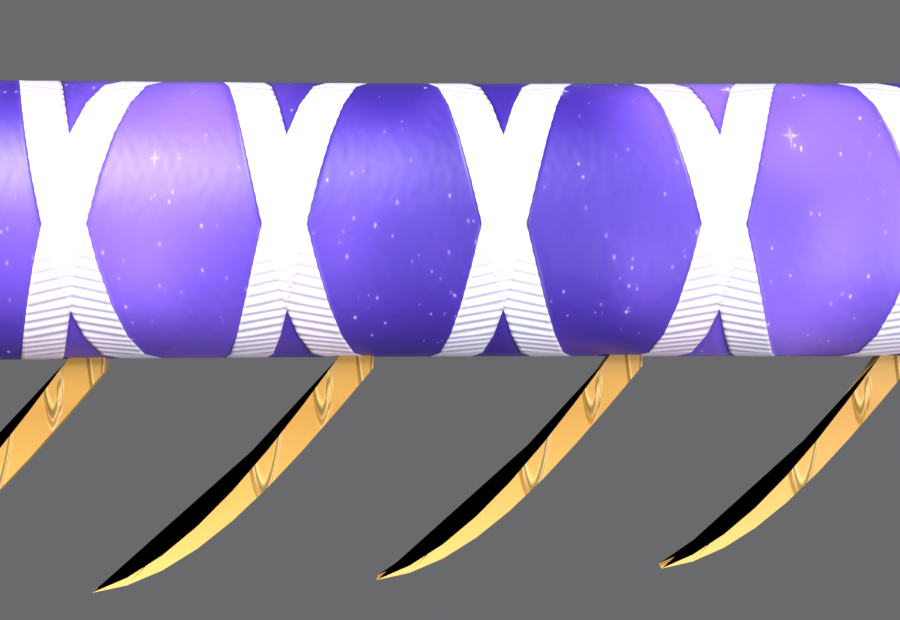

# 刀 (VRChat 用 / 夢想の一太刀 風・ファンメイド)

原神の雷電将軍が元素爆発で使う刀をもとにした、アバターに持たせる刀のモデルです。
参考画像を見ながら独自に作ったファンメイドのモデルです。個人で楽しむ範囲で使ってください (販売・配布はしないでください)。

暗い場所での見え方 (光のにじみ = ブルームありのワールドを想定):

鍔まわりと刀身 (同じくブルームあり):

明るい場所での見え方 (ブルームなし):

柄 (銀の組紐の織り目・金の爪の唐草の彫り):

## 仕様

| 項目 | 内容 |
| --- | --- |
| 大きさ | 全長 約 1.03m (刃 80cm (峰に沿った長さ)・柄 20cm・柄頭の飾り 約 7cm) |
| 反り | 参考画像を測って再現: 根元から半ばまではゆるやか、先の 2 割で急に曲がる先反り。反りの深さは弦の約 7.9% |
| 刃 | 幅は切っ先近くまでほぼ一定 (3.2cm)、先 12% で細くとがる。薄紫に白く光る地、中央に炎のような紫の模様 (根元はとがって始まり、切っ先近くで炎のすじにほどける) |
| 刃の付け根 | 白く光る三つ巴の紋 (立体。外側の円はなく、濃い紫の台座の上に 3 つの巴、刃の幅からはみ出す)、峰側から柄の方へ約 40° に伸びる細長い紫のトゲ、濃い紫の鎺 |
| 鍔 | 細長い棒状 (両端は斜めにとがる)、白く光る |
| 柄 | 紫のマーブルに銀の柄巻き (斜めに交差)、峰側に金の爪飾り 5 本、白く光る玉 2 つ、濃い紫の縁、金の柄頭、先に黄色く光る炎 |
| 向き | Unity で刃が上 (Y)、刃先が前 (+Z)。原点は鍔の中心 |
| 目印 | `Grip` (握る位置、柄の中央) / `Tip` (切っ先)。どちらも Katana の子の空オブジェクト |
| ポリゴン | 3,260 三角形 |
| マテリアル | 2 個: `Katana_Blade` (光る部分: 刃・紋・ヒレ・鍔・玉・炎) / `Katana_Hilt` (柄巻き・金具) |
| テクスチャ | 3 枚 (どれも 8192×8192、2 つのマテリアルで共有、FBX には埋め込まず隣に置く): `Katana_Atlas.png` (色) / `Katana_Emission.png` (発光) / `Katana_Normal.png` (ノーマルマップ) |
| 色 | 参考画像 (ゲーム画面) の色をもとにした幻想的な配色。刀身の地は根元→切っ先へオーロラのように移ろう薄紫・桜色・青みの薄紫、模様は夜空のような深い紫 |
| 刀身 | なめらかに揺らめく炎の形の模様 (中心は深い紫、縁ほど明るい宝石のようなグラデーション、光る縁のライン、外側に光のにじみ)、模様の中を流れるシルクのような光の帯、枝分かれする細い稲妻、星屑と星のきらめき、白く柔らかく光る刃文と沸 |
| 柄・金具 | 星雲のような柔らかい紫に星のきらめき、真珠のような銀の組紐 (織り目つき)、金具に唐草の彫り |
| 鍔・トゲ | 鍔: 真珠のような光沢と淡く光る線、彫りの二重線 / トゲ: 付け根の深い紫から先端の明るい紫へ、光る筋と縁、星屑 |
| 発光 | 地はピンク寄りの薄紫にほのかに、模様の縁・稲妻・星屑・刃文・沸は強く光る。三つ巴・光る玉・柄頭の炎・鍔も強く光る。柄と金具は光らない |
| 凹凸 | ノーマルマップ: 柄巻きの盛り上がりと織り目、金の彫りの溝、刀身の模様のなめらかな彫り込み、鍔の彫り、トゲの筋 |
| 動作確認 | Blender 5.1.2 |

## ファイル

- `make_katana.py` … Blender で刀を作って FBX に書き出すスクリプト
- `make_katana_texture.py` … 3 枚のテクスチャを作るスクリプト (Pillow と numpy を使用)
- `Katana_Atlas.png` / `Katana_Emission.png` / `Katana_Normal.png` … 生成済みのテクスチャ
- `export/Katana.fbx` … 書き出し済みの FBX (Blender 5.1.2 で作成)

## Blender での使い方

1. `make_katana.py` と 3 枚のテクスチャ (`Katana_Atlas.png` / `Katana_Emission.png` / `Katana_Normal.png`) を同じフォルダに置く
2. Blender の **Scripting** タブ → **テキスト → 開く** で `make_katana.py` を開く
3. **▶ (スクリプト実行)** (Alt+P)
4. シーンに `Katana` / `Grip` / `Tip` ができ、`Katana.fbx` と 3 枚のテクスチャが書き出されます
   (.blend を保存していればそのフォルダ、未保存ならスクリプトのフォルダ)

大きさはスクリプト上部の `SCALE` (全体)、`BLADE_LEN` (刃の長さ)、`HANDLE_LEN` (柄の長さ)、
`CURVE_BASE` / `CURVE_TIP` (反り: 根元側 / 先の曲がりの角度)、`BLADE_W` (刃の幅) で変えられます。

## Unity に入れるとき

- FBX は「回転 0・スケール 1・1unit = 1m」で読み込まれる設定で書き出しています。
- `Katana.fbx` と 3 枚のテクスチャを同じフォルダに入れてください。
- `Katana_Normal.png` はテクスチャ設定の **Texture Type を Normal map** にしてください。
- lilToon の設定 (2 つのマテリアルとも):
  - メインカラー: `Katana_Atlas.png`
  - ノーマルマップ: 「ノーマルマップ」をオンにして `Katana_Normal.png`
  - `Katana_Blade` だけ: 「発光」をオンにして、テクスチャに `Katana_Emission.png`、色は白 (明るさはお好みで)
- 幻想的に見せるコツ: ブルーム (光のにじみ) のあるワールドでいちばん映えます。発光の明るさを 1.5〜2 くらいに上げると、稲妻や星屑がにじんで光ります。
- テクスチャはどれも 8192×8192 です。Unity のテクスチャ設定の **Max Size を 8192** にすると最大の解像度で使えます。
  ただし VRChat ではテクスチャのメモリが大きくなり、パフォーマンスランクが下がります (8192 は 1 枚で約 85MB)。
  重いときは Max Size を下げてください (作り直しは不要です)。目安: 色 4096、ノーマル 4096、発光 2048。
